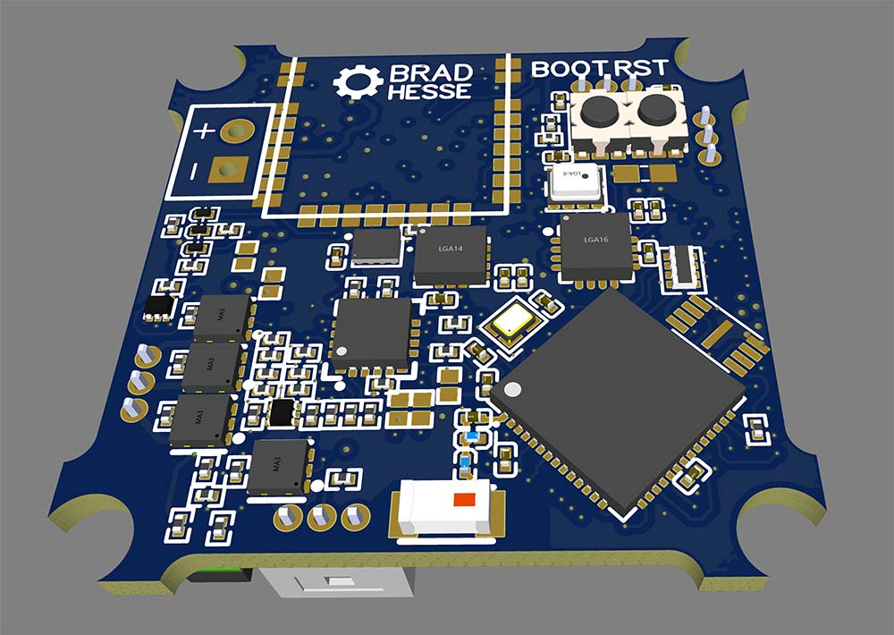
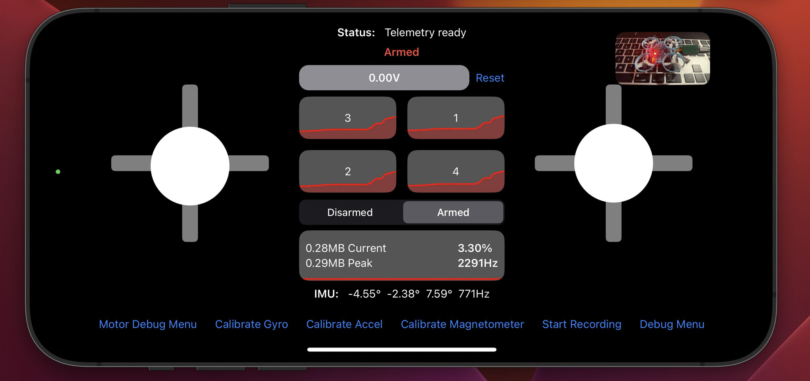

# MicroQuad
## An ESP32 based micro-quadcopter project [Under Development]
This repo is based on the ESP32 architecture to implement a custom Bluetooth controlled 'smart' quadcopter, with a custom PCB design, using the BetaFPV 65S frame + brushless motors, it is in the early stages. 

Ultimately, this project will be broken up into components that will make it easier for open-source developers to build their own quadcopter designs. It will enable sensor fusion for common IMU chips (like the MPU6000, MPU6050, ICM426XX, as well as magnetometers and GPS units) to allow for easy customization.

### Features
- ESP32-S3 SoC
- ICM42688P Accelerometer + Gyro
- RYS8830 GPS
- QMC5883L Magnetometer
- BME280 Air Pressure Sensor
- VL53L1CX Range Finder
- MCP73871T Battery Mgmt + Load Sharing
- Breakout Board with USB-C via Small Ribbon Cable

### To Build & Flash
- Run `idf.py build` to check if the project builds
- Run `idf.py flash` to flash to a connected ESP32

### To Debug in VS Code 
- Launch OpenOCD using the command `idf.py openocd`
- In VS Code's debug menu click 'Start Debugging' with the [Eclipse CDT Remote](https://github.com/espressif/vscode-esp-idf-extension/blob/master/docs/DEBUGGING.md) target

### Notes on Hacks
- Currently there are a few hardcoded hacks here:
- In VS Code's `.vscode/settings.json`, we are currently hardcoding a lot of `esp32` executable paths which is not ideal because it will break whenever versions change
- Also in `settings.json` we are hard coding the device serial port which is even hackier

### TODO List
- [X] Add iOS controller codebase
- [ ] Add PCB schematic + gerber files
- [ ] Update firmware to utilize radians everywhere in the codebase instead of using degrees
- [ ] Clean up the DebugHelper, there is a lot of now-unncessesary code in there
- [ ] Break up the codebase in general, for example the core stability logic should be extracted to a different component from the Logger
- [ ] Update PCB to use a more recent barometric sensor than the BME280
- [ ] Update magnetometer to use a more recent sensor than the QMC5883L, newer mags are less sensitive to EMI noise
- [ ] Utilize separate GPIO's for ESC DShot telemetry, it is supposed to be bidirectional but the ESP32 cannot switch between output/input modes on a GPIO pin fast enough for this to be feasible with only a single pin. 
